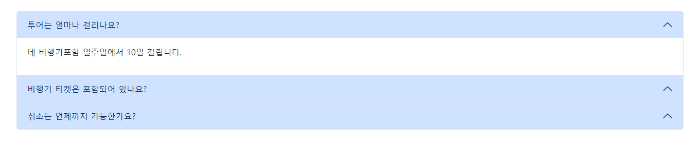
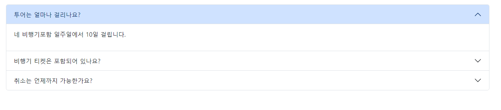

# Bootstrap5
수업용 부트스트랩

## 부트스트랩 예제

> 수업시간에 만든 부트스트랩 사이트

- 부트스트랩 레이아웃 / 컨텐츠 사용
    - 컨테이너
    - 그리드
    - 테이블
- 부트스트랩 컴포넌트 사용
    - 네비게이션 바
    - 카드
    - 아코디언
    - 경고창
    - 버튼
    - 캐러셀
    - 모달
    - 스피너
    - 스크롤스파이

## BS5-Tour 문제
> 부트스트랩 활용 페이지 만들어 보기

- 오버뷰섹션
    - d-flex 
        - align-items-center은 적용이 되나 가운데 정렬인 justify-content-center는 적용이 되지 않은 현상
        
        - div 안에 text-center적용
        

- 네비게이션 바 스크롤 효과
    - `<body data-bs-spy="scroll" data-bs-target="#nav-scroll">` 이용
        - section id 값을 li 내부 href="#id값" 동일하게 설정 시 해당 부분으로 접근 시 효과 발생 
        
        - 해당 영역 이동시 nav 글씨색 변경
        - nav영역 패키지, FAQ 클릭시 해당 섹션으로 이동

- 버튼 클릭 모달 효과
    - 해당 `button` data-bs-toggle="modal" data-bs-target="#id값" 넣기
    - 모달창 section id값 입력
        

- FAQ
    - 재시작 시 항상 버튼 부분이 파란색 적용이 된 상태
    
    - `button` 부분 collapsed 입력으로 해당부분 적용 안됨
    

# 웹페이지 크롤링(미완성)
- 프론트(HTML, CSS, BOOTSTRAP) 클론 경험을 통해 실력 향상
- [배포]()

- 공부자료
    - [링크](https://velog.io/@drv98/series/%EB%B6%80%ED%8A%B8%EC%8A%A4%ED%8A%B8%EB%9E%A9)